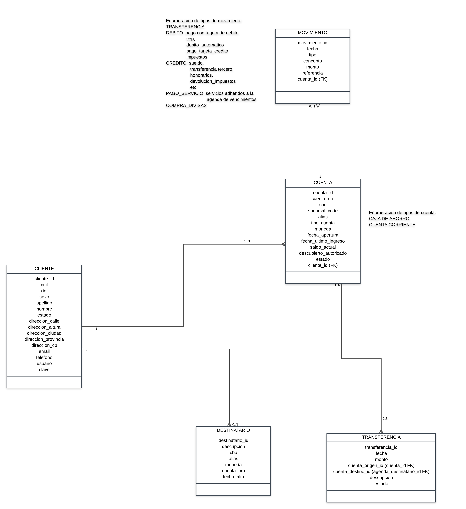

# challenge-bank-l2

Challenge que pretende simular algunos requerimientos de un sistema bancario.
Se debe desarrollar un backend que cumpla con los requerimientos listados a continuación.

## Requerimientos funcionales a implementar:
- Poder registrar un nuevo cliente al cual se le deberá asignar una cuenta con número de cuenta y tipo "Caja de Ahorro".
- Cada cliente debe poder ingresar con cliente y clave al sistema.
- Al ingresar al sistema el cliente debe visualizar sus cuentas con el saldo actual de cada una.
- Un cliente debería poder consultar los movimientos asociados a alguna de sus cuentas.
- Un cliente debería poder agendar destinatarios para realizar transferencias.
- Un cliente debería poder consultar su agenda de destinatarios.
- Un cliente debería poder transferir a alguno de los destinatarios que tenga agendados, pudiendo visualizar y descargar al finalizar dicho flujo un comprobante con la información de la transferencia realizada.

## Otras consideraciones:
- Implementar los tests unitarios para al menos dos requerimientos.
- Hacer uso de Spring Security para la autenticación.
- Hacer uso de Spring Cache en alguno de los requerimientos y justificar por qué.
- Respetar el diagrama entidad relación provisto:

## Qué entregar?
Como entregable se espera un fork de este repositorio con la implementación de los diferentes requerimientos. 
El código debe poder ejecutarse y se pretende que se haga uso de al menos Java 17 para resolver el challenge.
Debe hacerse uso de Spring Boot y Spring Data JPA para implementar la solución.